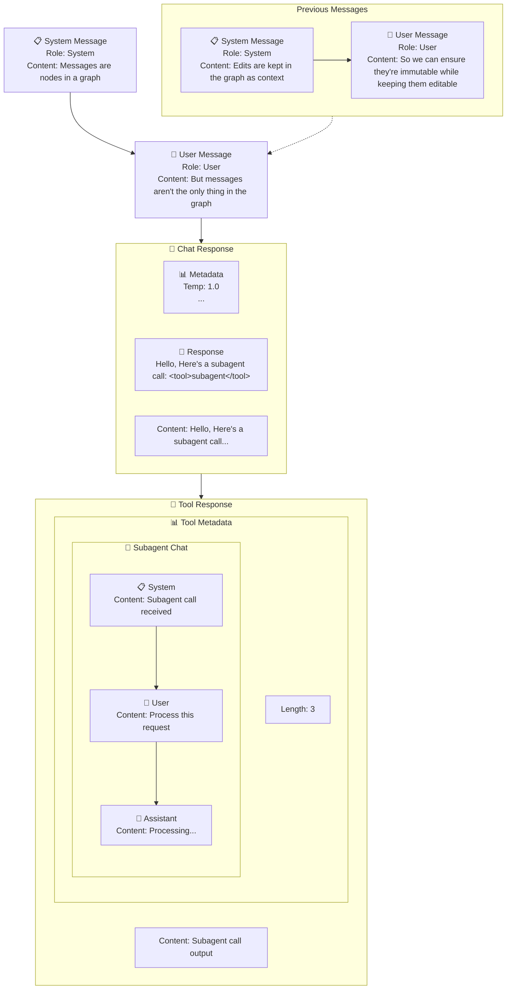

# Message Graph

Messages should be a graph of immutable elements.

## Why immutable elements?
We want to train on policy
- This means the context cannot change after we call a response.

## Why a graph?
Nodes and connections are a natural way to represent the flow of information in an agent conversation.

## Will this be annoying to deal with?

It shouldn't be! While there will be internal stuff that may look ???, for the interface, it should be as simple as your
normal context window edits, so `message_history[2]['content'] = my_edit`, but internally we'll deal with the recordkeeping
and how this ends up parsing into on policy training data, if requested.